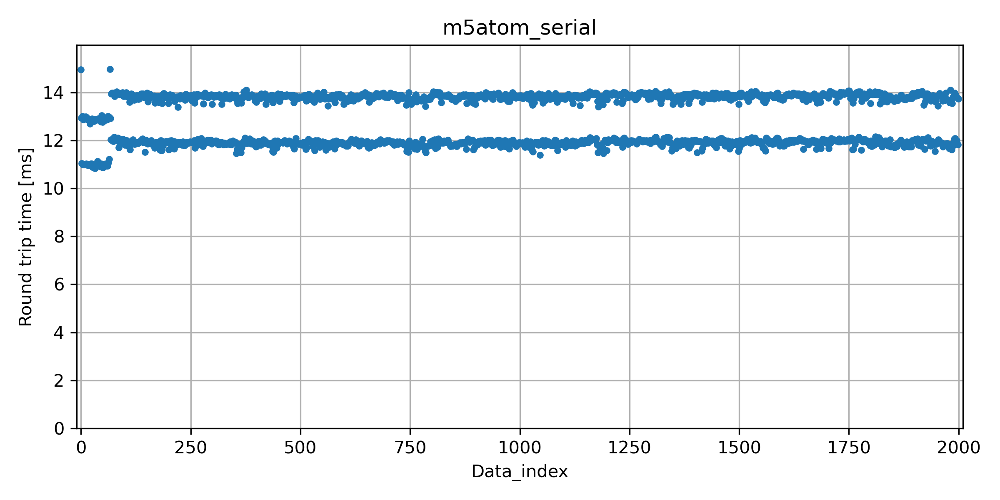
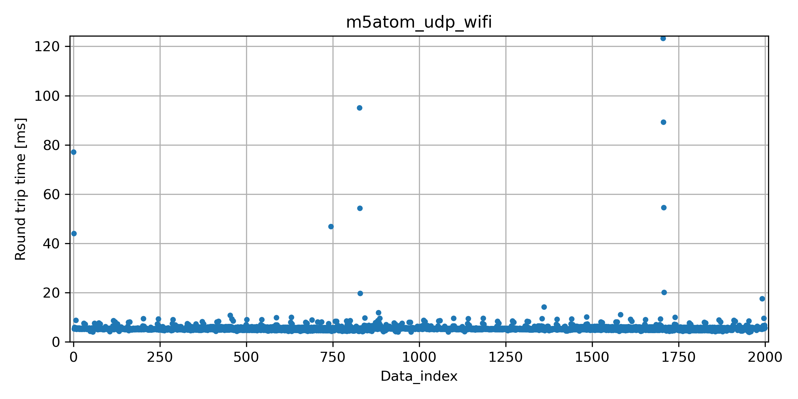
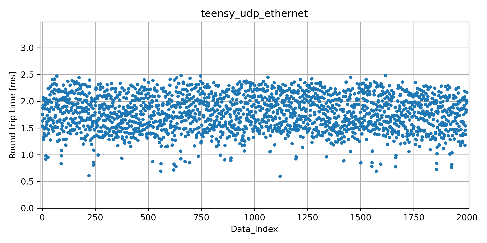

# microros_latency_eval

[micro-ROS](https://micro.ros.org/)の通信時間を評価する。ここでの通信時間とは、PCからマイクロコントローラへのトピック発行から、マイクロコントローラが発行したトピック購読までの時間とする。なお、マイクロコントローラは、購読したトピックをすぐにそのまま発行する。

PC-マイクロコントローラ間の通信は、以下の3つを評価。
* usb-serial
* wifi
* ethernet

マイクロコントローラは、usb-serialとwifiでは[M5stack ATOM Matrix](https://docs.m5stack.com/en/core/atom_matrix)を、ethernetでは[Teensy 4.1](https://www.pjrc.com/store/teensy41.html)を使用した。

## Usage

ROS2と、platformioのインストールが必要です。

### Build

#### ROS2 ping node
PC上で動作するROS2ノード
```bash
cd ping_ros2
source \opt\ros\humble\setup.bash
colcon build
```

#### usb-serial, M5Atom
```bash
cd pong_m5atom_serial
pio run -t upload
```

#### wifi (udp), M5Atom
```bash
cd pong_m5atom_wifi
# ssid_nameとssid_passを編集後に実行
PLATFORMIO_BUILD_FLAGS="-D __SSID__=\\\"ssid_name\\\" -D __SSID_PASS__=\\\"ssid_pass\\\"" pio run -t upload
```
参考：[あすき, "試行錯誤な日々:PlatformIOのビルド時のコマンドでマクロの変数を定義する方法," 2019.](https://asukiaaa.blogspot.com/2019/04/platformio.html)

#### ethernet (udp), Teensy 4.1
```bash
cd pong_teensy41_ethernet
pio run -t upload
```

参考：[@NobuHandMaker, "Teensy4.1でROS2完全に理解した," Qiita, 2021.](https://qiita.com/NobuHandMaker/items/f5a9dc0695389bdea5a3#platformioを使う場合) Teensy + PlatformIO

### 遅延評価プログラムの実行
それぞれの通信方式に対応するプログラムを書き込んだマイクロコントローラをPCに接続後に実行する。なお、microros Agentはdockerで起動させている。

```bash
cd eval

# usb-serial, M5Atom
./eval_m5atom_serial.sh

# wifi (udp), M5Atom
./eval_m5atom_udp_wifi.sh

# ethernet (udp), Teensy 4.1
./eval_teensy_udp_ethernet.sh
```

## 評価例

### 評価環境
* PC: ubuntu22.04, Intel Core i7-12700, 32GB
* スイッチングハブ: [Buffalo WSR-300HP](https://www.buffalo.jp/product/detail/wsr-300hp.html)

### 評価結果
[std_msgs/Int32MultiArray](https://docs.ros.org/en/melodic/api/std_msgs/html/msg/Int32MultiArray.html)型(長さ4=16byte)のトピックを50ms間隔で2000回送受信。
各トピックの送信から受信までの時間[ms]の平均、最大、最小、標準偏差を示す。

|           | usb serial (M5Atom) | udp wifi (M5Atom) | udp ethernet (Teensy4.1) |
| ----      | ----  | ----  | ----  |
| average   |12.830 | 5.813 | 1.774 |
| max       |14.971 |123.242| 2.485 |
| min       |10.838 | 3.980 | 0.597 |
| std.p     | 0.987 | 4.689 | 0.342 |







## 所感
Ethernetでも1ms切れないし結構遅い。Agentが必要なのもイマイチですね。embeddedRTPSというDDSの通信プロトコルRTPS実装でAgentレスにする取り組みもあるらしい([embeddedRTPS: the new experimental middleware for micro-ROS](https://discourse.ros.org/t/embeddedrtps-the-new-experimental-middleware-for-micro-ros/22741))。
また、micro-rosの対抗馬として、[mros2](https://github.com/mROS-base/mros2)もあるらしい。これもembeddedRTPSを使っているらしい。

## 参考

1. [高瀬英希, 檜原陽一郎, "組込み向け ROS 2 ノード実行環境の定量的評価," ロボティクス・メカトロニクス、 2022.](https://www.jstage.jst.go.jp/article/jsmermd/2022/0/2022_1P1-Q09/_pdf)
1. [システム計画研究所, "ROS2 リアルタイムの最新動向の紹介と、ROS2 への期待," SWEST22, 2020.](https://swest.toppers.jp/SWEST22/program/pdfs/s3b_public.pdf)
1. [Gutiérrez, C. S. V., Juan, L. U. S., Ugarte, I. Z., & Vilches, V. M., "Towards a distributed and real-time framework for robots: Evaluation of ROS 2.0 communications for real-time robotic applications," arXiv preprint arXiv:1809.02595, 2018.](https://arxiv.org/pdf/1809.02595.pdf)
1. [Kronauer, T., Pohlmann, J., Matthé, M., Smejkal, T., & Fettweis, G., "Latency Analysis of ROS2 Multi-Node Systems," in Proc. of 2021 IEEE Int. Conf. on Multisensor Fusion and Integration for Intelligent Systems (MFI) pp. 1-7, 2021.](https://arxiv.org/pdf/2101.02074.pdf)
